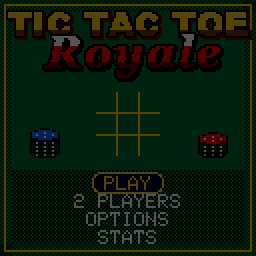
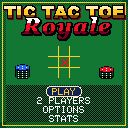
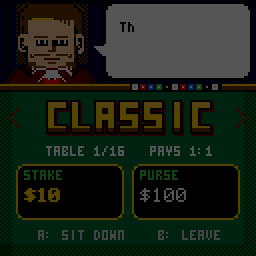
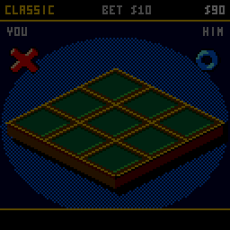
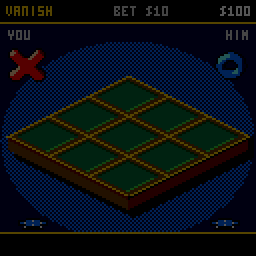
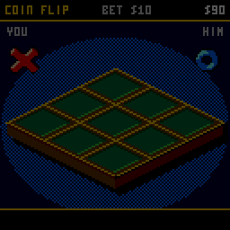
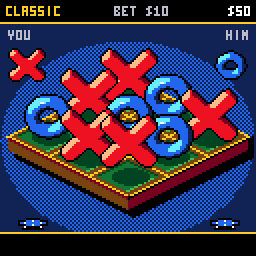
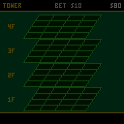
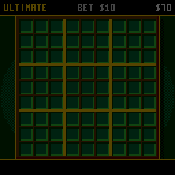
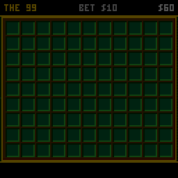

# CHTicTacToe - TIC TAC TOE: ROYALE

Noughts and crosses, for money, for the
[CHGame](https://github.com/bateske/CH32SerialBoot) handheld (CH32X035
RISC-V, 128x128 colour LCD, piezo), in the casino style of
[CHBlackjack](https://github.com/bateske/CHBlackjack),
[CHChess](https://github.com/bateske/CHChess) and
[CHRoulette](https://github.com/bateske/CHRoulette). The world's simplest
game gets the VIP room: seventeen tables with seventeen sets of rules, a
stake on every game, the croupier from Blackjack's tables explaining each
one with a straight face, "TIC", "TAC" and "TOE!" called as a line builds,
the winning line struck through in rainbow, and a cat that walks across
the felt whenever nobody wins. The 3x3 and 5x5 tables are played in
CHChess's isometric view: a walnut board with gold-inlaid lines and felt
pads under a spotlight, lacquered Xs and Os standing on it, each carried
in by a glove and dropped with a bounce. A piece held over one already on
the board rises clear of it, and the board lowers itself when a piece
needs the headroom. SELECT flips to a flat map: the same walnut board seen
from above, its felt pads shaded and gold-inlaid, on spotlit felt.

| Title | The tables | A win |
|---|---|---|
|  |  |  |
| **VANISH** | **COIN FLIP** | **A cat's game** |
|  |  |  |
| **TOWER** | **ULTIMATE** | **THE 99** |
|  |  |  |

(Captured from the PC simulator in `tools/chsim`, which runs the real game
and graphics code and renders what the device shows.)

**Status:** built and tested in the PC simulator only. It has not been run on
a CHGame yet, so frame times, the dealer's thinking time and every sound
are unchecked on the device.

The croupier is Press Play On Tape's dealer from their Arduboy Blackjack
(**vampirics**, art; **filmote**, code), as recoloured for CHBlackjack, as
are the end screens' lettering and the 3x5 font. Apache-2.0, like this
game; see `LICENSE` and `NOTICE`.

## Installing

You need the Arduino IDE (2.x) or `arduino-cli`, and:

1. **The CHGame board package, 0.2.4 or later** (Boards Manager URL
   `https://github.com/bateske/CH32SerialBoot/releases/latest/download/package_chgame_index.json`).
2. **The CHGfx library, 1.3.0** from <https://github.com/bateske/CHgfx>.
3. **This repository**, in a folder named `CHTicTacToe`.

Pick *Tools > Optimize > Smallest + LTO* and *Tools > USB > Upload only*
(the game has no use for USB Serial; uploading works as before). Built
that way it is 43.9 KB of the 50,944-byte application region, which leaves
the last two flash pages for saving. From the command line:

    arduino-cli compile -b CHGame:ch32v:CHGame:opt=oslto,rtlib=nano,periph=game,usb=uploadonly CHTicTacToe
    arduino-cli upload  -b CHGame:ch32v:CHGame -p COMx CHTicTacToe

(`python tools/device.py build` does the same.)

## Playing

| Button | At a table | Elsewhere |
|---|---|---|
| D-pad | move the glove; on the iso tables it goes to the nearest cell that way on screen (TOWER: up and down past a floor's edge changes floor) | menus; in the tables room left/right picks the table, up/down the stake |
| A | place your mark | select |
| B | GOBBLE: next size; WILD: place an O | back |
| SELECT | 3x3 and 5x5 tables: the iso table or the flat map (it stays as you leave it); other tables: the rules | |
| START | pause: resume, how to play (the rules), options, walk away (the stake stays) | |

You start with $100. Pick a table and a stake ($5 to $250), and play the
dealer. A win pays the table's odds, a draw is a push, a loss costs the
stake. Wins in a row add a quarter of the winnings each, up to double. The
run ends when you reach the goal ($1000 by default) or can't cover $5.

### The tables

| # | Table | Rules | Pays |
|---|---|---|---|
| 1 | CLASSIC | 3x3, three in a row | 1:1 |
| 2 | BLITZ | 60 seconds of boards, 3 seconds a move or a random square is played for you; a lost board costs 5 seconds; boards won pay 1/4, 3/4, 1 1/2, 2 1/2, 3 3/4... of the stake | by the board |
| 3 | MISERE | three in a row loses | 1:1 |
| 4 | ALL X | both sides play X; whoever completes three in a row loses (notakto) | 1:1 |
| 5 | VANISH | three marks a side: place a fourth and your oldest disappears; no draws | 1:1 |
| 6 | GOBBLE | chips in three sizes, two of each; a bigger chip may cover a smaller one | 3:2 |
| 7 | WILD | play an X or an O each turn; whoever completes a line of either wins | 1:1 |
| 8 | DARK | the dealer's marks are hidden; walking into one reveals it and you move again | 2:1 |
| 9 | COIN FLIP | a coin toss before every move decides who makes it | 1:1 |
| 10 | AUCTION | both sides have 8 chips and bid for each move; the higher bid moves and pays the other; ties go turn about | 2:1 |
| 11 | BIG 5 | 5x5, four in a row | 2:1 |
| 12 | WRAP | 5x5, four in a row, and lines continue round the edges | 1:1 |
| 13 | MINES | 5x5, four in a row; four hidden mines: a mark put on one is lost and the cell is dead | 3:1 |
| 14 | DROP 4 | 7x6, marks fall to the bottom of their column, four in a row | 2:1 |
| 15 | TOWER | 4x4x4, four in a row along any of the 76 lines | 3:1 |
| 16 | ULTIMATE | nine 3x3 boards; the square you play picks the board the other side must play in; three boards in a row wins (all boards decided: most boards) | 5:1 |
| 17 | THE 99 | 11x9 = 99 squares, five in a row | 5:1 |

You move first, except in BLITZ, where the opening alternates.

### Options

- **DEALER**: TIPSY (he slips up; the odds as listed), SHARP (pays double),
  SHARK (pays triple).
- **GOAL**: $1000, $5000 or ENDLESS.
- **SOUND**: on or off.
- **CROUPIER**: CLASSIC or NIGHT colours.

### 2 PLAYERS

Two people take turns on one handheld (the second player's glove has the
red cuff). No money: the score is kept instead. BLITZ, DARK and AUCTION
are not offered, since they need a clock or a secret.

## How it fits

- **Flash**: 50,168 B release (both save pages kept, 264 B spare). One board type (up to
  99 cells, a line length, rule flags) and one line scanner serve every
  table, so a new table is mostly a flag and a paragraph. The iso view is
  about 6 KB of it. Device debug builds (the protocol is ~1.7 KB) leave out
  saving and the end screens' PPOT lettering (`CHTT_LEAN`).
- **The pieces** are ray-marched from signed-distance models by
  `tools/pieces.py` (after CHChess's) at the board's 30 degree camera, in
  two sizes, and quantised to the palette; the PNGs in `tools/art/pieces/`
  can be touched up by hand.
- **The dealer**: on 3x3 tables a depth-limited search of the real rules;
  on the big felts every empty cell is scored by the lines it could still
  make or break, 12 cells a frame.
- **Drawing**: the play screen is redrawn only on frames where something
  moved, and in iso, when only the glove or the cursor moved, only the band
  of rows they swept is drawn again (a full iso frame is estimated at
  ~7 ms, a glove move at ~5 ms; neither is measured on the device yet).
  `tools/chsim/diffdrive.py` checks band redraws against full ones pixel
  for pixel. Palette cycling animates the cursor, the fading VANISH mark
  and the winning line with no redraw.
- **Saving**: options, statistics and the run (purse, table, stake,
  streak) in the last two flash pages, every five games and on leaving.
- **Sound**: CHBlackjack's piezo sequencer, effects only (no music).

## Development

- `python tools/tests/run_tests.py [table]`: host tests of the rules, the
  dealer and the match flow (with `table`, the dealer's results against a
  random player at every table and level).
- `python tools/chsim/chsim.py build .`: build the PC simulator (needs a
  C++ compiler: `CHSIM_CXX`, zig, clang++ or g++).
- `python tools/chsim/chdrive.py --sim . tools/scripts/smoke.txt out/smoke`:
  run a script; `smoke` (every screen and table), `endings`, `save`,
  `perf`, `hover`, `showcase` and `gameplay` (the GIFs above, into `docs`).
- `python tools/device.py build|upload [--debug]`, `python tools/check_size.py build/release`.
- `python tools/assets.py`: rebuild `src/assets` from `tools/art`.
  `python tools/make_logo.py` redrafts the title lettering;
  `python tools/pieces.py` re-renders the iso pieces (overwriting the PNGs).
- `python tools/chsim/diffdrive.py tools/scripts/diff_iso.txt out/diff 1`:
  band redraws against full redraws (0 stale frames expected).
- `python tools/audio/preview.py out/audio`: the effects as WAV files.

## Files

    CHTicTacToe.ino   setup, the frame loop, debug commands
    src/game/         Rules (every table), Cpu (the dealer), Match (turns, toss, bids, clock), Text
    src/render/       Stage (the play screen), Iso (the isometric tables), Table (the dealer's wall), ChipArt
    src/states/       Screens: title, tables room, play, options, stats, win, broke
    src/gfx, src/fx   palette, drawing, lettering, particles, banners
    src/audio, src/save, src/debug
    tools/            assets, simulator, scripts, tests

## License

Apache-2.0. See `LICENSE` and `NOTICE`.
